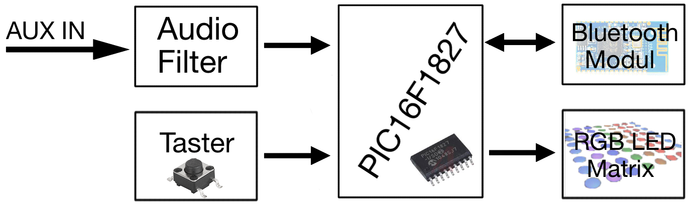
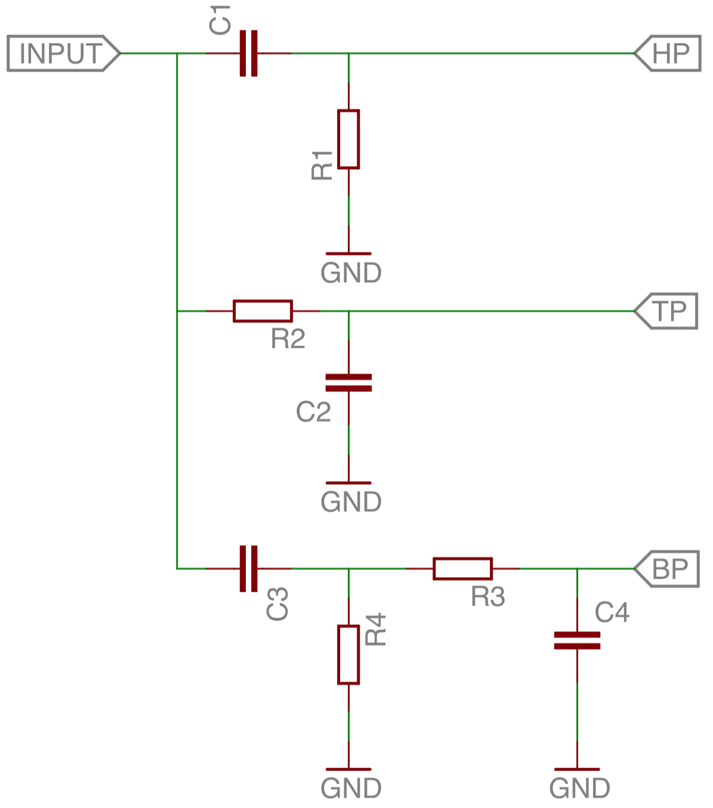
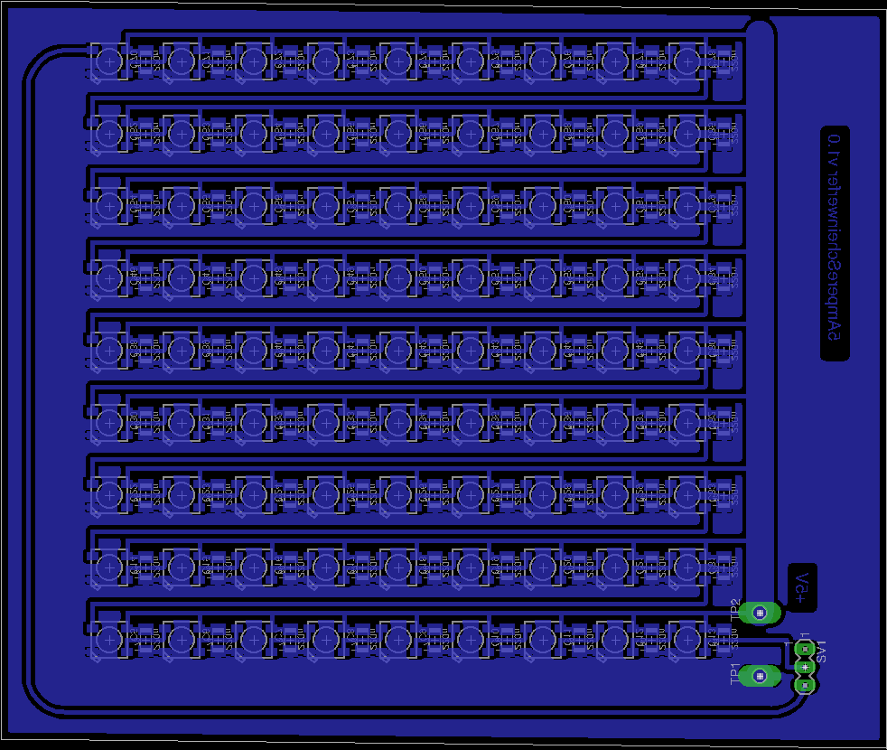
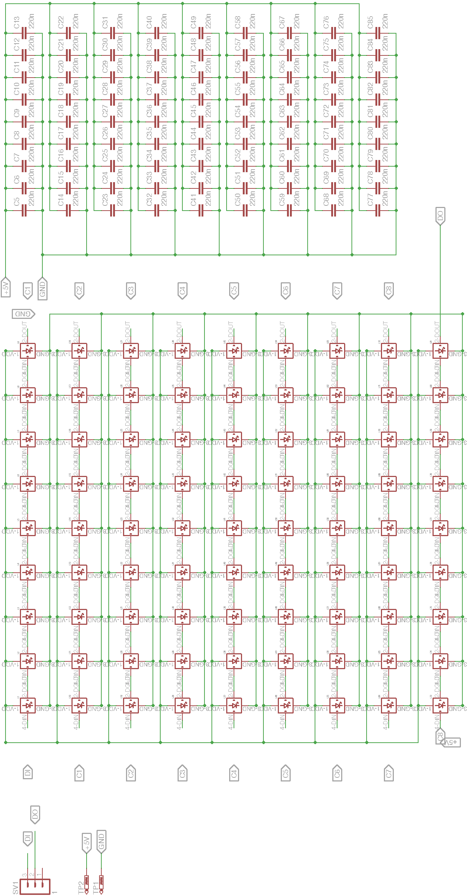
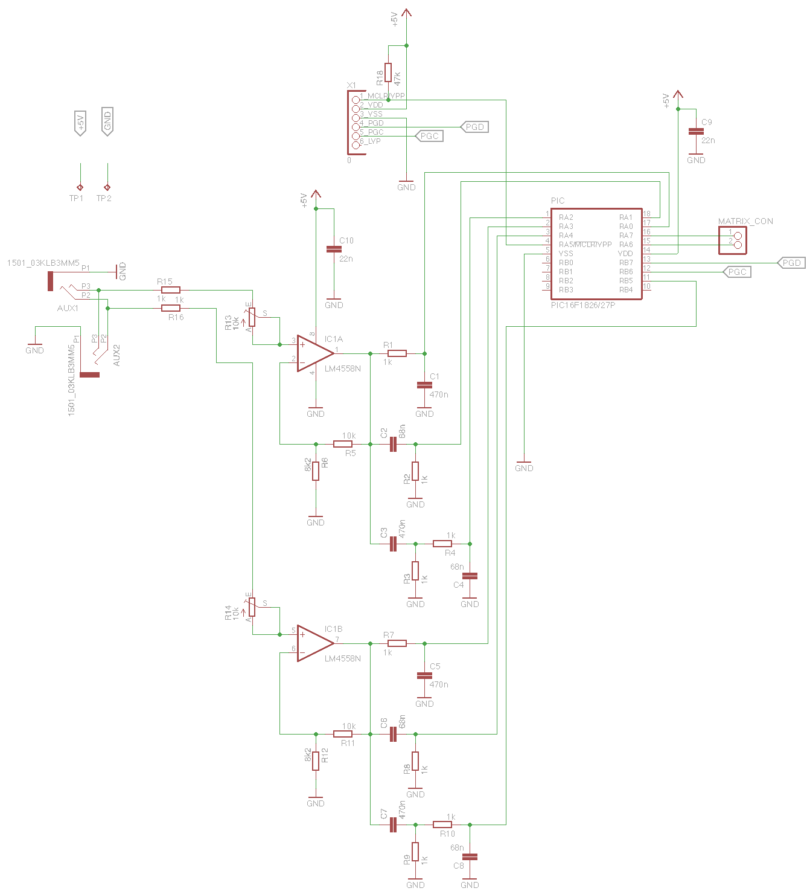
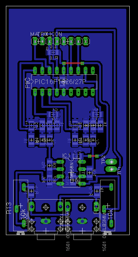

 
 
 
 
 
 
 
 
 
 
 
 
 
 
 
 

#Audio Visualiser
#RGB LED Display
github.com/manuel-fede/AudiVis

(c) Manuel Federanko

<!-- START doctoc generated TOC please keep comment here to allow auto update -->
<!-- DON'T EDIT THIS SECTION, INSTEAD RE-RUN doctoc TO UPDATE -->
**Table of Contents**

- [1. Erste Beschreibung](#1-erste-beschreibung)
- [2. Messungen der Audiosignale](#2-messungen-der-audiosignale)
  - [2.1. Output eines Xperia Z](#21-output-eines-xperia-z)
  - [2.2. Output eines MacBook Pro](#22-output-eines-macbook-pro)
- [3. Blockschaltbild](#3-blockschaltbild)
- [4. Verstärker & Filter](#4-verst%C3%A4rker-&-filter)
  - [4.1. Verstärker](#41-verst%C3%A4rker)
  - [4.2. Filter](#42-filter)
    - [4.1.1 Berechnung](#411-berechnung)
- [5. LED Matrix](#5-led-matrix)
  - [5.1. Layout](#51-layout)
  - [5.2. Schaltplan](#52-schaltplan)
- [6. Filterplatine](#6-filterplatine)
  - [6.1 Schaltplan](#61-schaltplan)
  - [6.2 Layout](#62-layout)
  - [6.3 Pinbelegung](#63-pinbelegung)
- [7. Sourcecode](#7-sourcecode)

<!-- END doctoc generated TOC please keep comment here to allow auto update -->

##1. Erste Beschreibung
Ziel ist es einen Audio Visualiser zu bauen, welcher, je nach Lautstärke und Frequenz aufleuchtet. Dieser Visualiser wird eine **9x9 RGB LED Matrix** besitzen, wird jedoch darauf ausgelegt, dass bis zu 1024 LEDs betrieben werden können. Fürs erste sind 3 Balken geplant, welche, je nach **Hochpass, Tiefpass und Bandpass** aufleuchten. Ein **Bluetooth-Modul** soll eine **Schnittstelle** zwischen anderen Geräten darstellen, um es einfach zu machen Änderungen vorzunehmen.

##2. Messungen der Audiosignale
Da zu Anfang nicht bekannt war, mit welchen Spannungen zu rechnen ist, wurde eine Messung Durchgeführt. Dies sind die Ergebnisse:

###2.1. Output eines Xperia Z

|Titel                                   |Vpp min/mV|Vpp max/mV|freq min/Hz|freq max/Hz|
|:---------------------------------------|---------:|---------:|----------:|----------:|
|Nicotine - Panic at the Disco           |    128.00|    350.00|     290.00|   2,900.00|
|What you waiting for? - Stefani Gwen    |     88.00|    570.00|     300.00|   3,600.00|
|Get Stupid                              |    300.00|    470.00|     200.00|   3,300.00|
|Magic is Timeless - Archie V            |     64.00|    130.00|      60.00|   1,400.00|
|Monster (DotEXE Remix) - Meg & Dia      |     60.00|     75.00|      90.00|   2,500.00|
|Rauschen                                |      3.00|

###2.2. Output eines MacBook Pro

|Titel                                   |Vpp min/mV|Vpp max/mV|freq min/Hz|freq max/Hz|
|:---------------------------------------|---------:|---------:|----------:|----------:|
|Nicotine - Panic at the Disco           |    120.00|    400.00|     300.00|   3,200.00|
|What you waiting for? - Stefani Gwen    |    120.00|    900.00|      50.00|   1,900.00|
|Get Stupid                              |    200.00|    620.00|     100.00|   1,700.00|
|Magic is Timeless - Archie V            |    260.00|    400.00|     200.00|   1,900.00|
|Monster (DotEXE Remix) - Meg & Dia      |    200.00|    400.00|   1,000.00|  10,000.00|
|Rauschen                                |     50.00|

Aus diesen Werten kann man schließen, dass eine **Verstärkung** von ca **5** vonnöten ist.

##3. Blockschaltbild

##4. Verstärker & Filter

###4.1. Verstärker
Der Verstärker ist nötig, um das Signal auf ein gut verwertbares Level zu Bringen. Die verstärkung muss ca 5 betragen, was aus den Messdaten unter [Messung der Audiosignale](#messung-der-audiosignale) hervorgeht. Um diese Verstärkung zu benutzen wird ein **Rail-To-Rail OPV** benutzt. Um es zu möglich zu machen die Verstärkung zu verändern wird ein **Potentiometer** mit **10k vor** den Eingang des **OPV** geschalten. Da außerdem eine Strombegrenzung vonnöten ist, wird ein **1k Widerstand** vor dem Potentiometer in Serie geschalten.

_Berechnung der Widerstände:_ 
Verstärkung = (RF+RN)/RN 
*RF = 10k *
------> RN = RF/(Verstärkung-1) 
------> *RN = 2k5*

###4.2. Filter
Die Filtereinheit besteht aus **2 identischen Filterblöcken**, die jeweils die Linke oder Rechte seite übernehmen. Jeder dieser Blöcke besitzt einen Hochpass, Tiefpass und Bandpass.

_Schaltung eines Blockes:_

####4.1.1 Berechnung
Da die Frequenzen natürlich nicht willkürlich gewählt sein sollen, werden zuerst die gewünschten Schwellen ausgemacht. Diese wurden unter [fairaudio.com](http://www.fairaudio.de/hifi-lexikon-begriffe/frequenzbereiche-bass-mitten-hochton-grundton.html) aufgelistet.

|Frequenzbereich|  Filter|
|--------------:|:-------|
|       -  350Hz|Tiefpass|
| 350Hz - 2.5kHz|Bandpass|
|2.5kHz -       |Hochpass|

_Daraus folgen diese Berechnungen:_ 
Ausgewählt:

R[1-4]= 1k

 - Tiefpass:

$$f_{g} = \frac{1}{2 \pi \tau} = 350Hz$$

$$------>C_{2} = \frac{1}{2 \pi f_{g} R} = \frac{1}{2\pi*350Hz*1k} = 454.728nF$$

 - Hochpass:

$$f_{g} = 2.5kHz$$

$$------>C_{1} = \frac{1}{2 \pi f_{g} R} = \frac{1}{2*\pi*2.5kHz*1k} = 63.662nF$$

 - Bandpass: 
Da das Ziel eine Bandbreite ist, welche alle Frequenzen eindeckt, welche zwischen dem Hoch und Tiefpass liegen, muss man im Prinzip nur die Werte der Kondensatoren für den jeweils anderen Filter nehmen.

$$------> C_{3} = 454.728nF$$

$$------> C_{4} = 63.662nF$$

<!-- NOTIZ: Entkoppelkondensator hat 22nF -->

##5. LED Matrix
Die Ledmatrix besteht aus 9x9 RGB LEDs (ws2812b), welche jede für sich genommen **60mA** maximal verbraucht. Jede einzelne LED wird einen Entkoppelkondensator von **220nF** benötigen. Durch die Bauweise der LEDs werden nur 2 Datenleitungen (CI, CO) und 2 Versorgungsleitungen (**+5V**, GND) gebraucht.

$$Gesamtstrom = 9*9*60mA = 4.86A$$

$$------>Stromversorgung = 5A$$

###5.1. Layout

###5.2. Schaltplan

##6. Filterplatine
Die Filterplatine beherbergt alle wichtigen Inputs, sowie Outputs. Auf ihr befinden sich die Audiofilter, der Prozessor sowie die Programmierpins. Ein OPV wird verwendet, um die Audiosignale auf ein verwertbares Level zu bringen, während die Potentiometer dazu dienen ein einfaches Einstellen der Sensitivität zu ermöglichen.

###6.1 Schaltplan

###6.2 Layout

###6.3 Pinbelegung

|             Port|             Pin#|   Analog/Digital|             Benutzung|                          Notiz|
|----------------:|----------------:|----------------:|---------------------:|------------------------------:|
|              RA0|               17|              AN0|  Tiefpassfilter Links|                               |
|              RA1|               18|              AN1|  Hochpassfilter Links|                               |
|              RA2|                1|              AN2|        Bandpass Links|                               |
|              RA3|                2|              AN3| Tiefpassfilter Rechts|                               |
|              RA4|                3|              AN4| Hochpassfilter Rechts|                               |
|              RA5|                4|                -|PICKit programmer con.|                   master clear|
|              RA6|               15|                -|       LED Matrix Data|                               |
|              RA7|               16|                -|        LED Matrix CLK|                  nicht benutzt|
|              RB0|                6|                -|              IO Input|                               |
|              RB1|                7|             AN10|             IO Output|                               |
|              RB2|                8|              AN9|                      |                               |
|              RB3|                9|              AN8|                      |                               |
|              RB4|               10|              AN7|                      |                               |
|              RB5|               11|              AN5|       Bandpass Rechts|                               |
|              RB6|               12|              AN6|PICKit programmer con.|        nur als programmier Pin|
|              RB7|               13|                -|PICKit programmer con.|        nur als programmier Pin|
|              VDD|               14|                -|          Power supply|                               |
|              VSS|                5|                -|          Power supply|                               |

##7. Sourcecode
Da bis dato noch keine Codebasis geschrieben wurde, verweise ich auf die Projektseite, auf welcher der Sourcecode erscheinen wird.